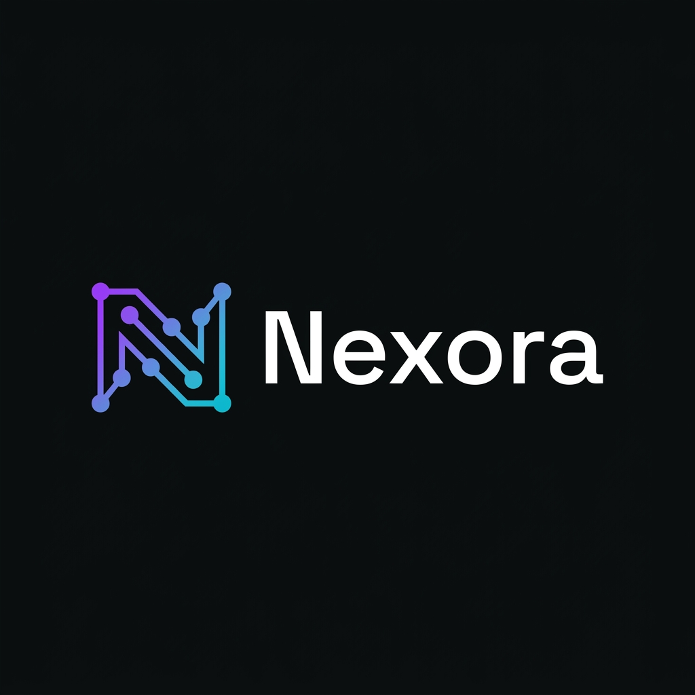
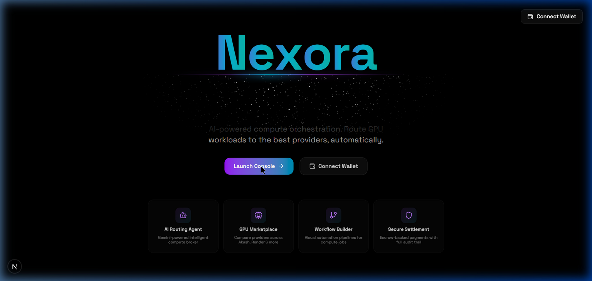
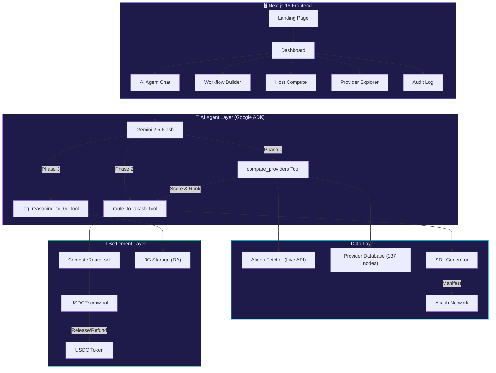
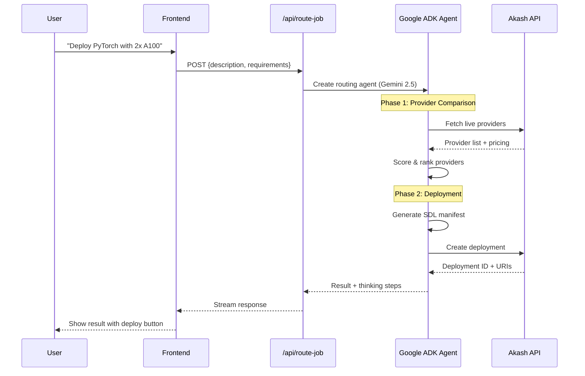

<p align="center">
  
</p>

<h1 align="center">Nexora — AI-Powered Compute Orchestration</h1>

<p align="center">
  <strong>Intelligent GPU workload routing · Multi-provider marketplace · Visual workflow automation</strong>
</p>

<p align="center">
  <a href="https://github.com/thesumedh/Nexora"></a>
  
  
  
  
  
  
</p>

<p align="center">
  
</p>

---

## 🎯 The Problem

The global GPU compute market is **fragmented and inefficient**:

| Pain Point | Impact |
|---|---|
| **Fragmented Markets** | Pricing across Akash, Render, Lambda, io.net is inconsistent and impossible to compare at scale |
| **No Intelligent Routing** | Manual provider selection wastes 40%+ on suboptimal pricing |
| **Settlement Risk** | No transparent escrow or audit trail — trust is assumed, not verified |
| **Complex Workflows** | Zero automation for recurring compute tasks and deployment pipelines |

> Enterprise teams sit on **millions of dollars of idle H100s and A100s** while developers globally struggle to access affordable compute.

## 💡 The Solution

**Nexora** is an AI-powered compute orchestration platform that acts as an **intelligent broker** between compute demand and supply. Think of it as **"Kayak for GPU compute"** — powered by AI.

```
┌──────────────────────────────────────────────────────────────────┐
│  User: "I need 4x A100 GPUs for training a LLaMA model"        │
│                          ↓                                       │
│  🤖 AI Agent: Analyzes requirements → Queries providers          │
│                          ↓                                       │
│  📊 Comparison: Akash ($2.10/hr) vs io.net ($2.85/hr)           │
│                          ↓                                       │
│  🚀 Auto-Deploy: Best provider selected, SDL generated, live    │
│                          ↓                                       │
│  🔒 Settlement: USDC escrow with full audit trail               │
└──────────────────────────────────────────────────────────────────┘
```

### How It Works

1. **Describe your workload** in natural language (e.g., *"Deploy a PyTorch training job with 2x RTX 4090"*)
2. **AI Agent analyzes** your requirements — GPU type, memory, budget, region, compliance
3. **Automatic routing** to the best provider with real-time pricing comparison
4. **One-click deployment** with SDL manifest generation and container orchestration
5. **Secure settlement** via smart contract escrow with full audit trail

---

## ✨ Key Features

| Feature | Description |
|---|---|
| 🤖 **AI Routing Agent** | Gemini 2.5-powered multi-step agent pipeline: analyze → compare → route → deploy. Uses Google ADK with forced tool-calling for deterministic execution |
| 📊 **Real-Time GPU Dashboard** | Live GPU pricing, availability, utilization metrics, and provider health across 7+ networks |
| 🔄 **Visual Workflow Builder** | Drag-and-drop automation pipelines with React Flow — chain triggers, logic, providers, and settlement nodes |
| 🏠 **Host Compute** | List your own GPU machines with region tagging, compliance controls, and availability scheduling |
| 🔒 **Smart Contract Escrow** | Solidity USDC escrow with auto-release on service completion and refund capability |
| 📋 **Immutable Audit Trail** | Full deployment history with on-chain transaction links and 0G Storage for reasoning logs |
| 🌐 **Multi-Provider Support** | Akash, Render, io.net, Spheron, Aethir, Nosana, Hyperspace, Gensyn — 137 normalized providers |
| 🐳 **Smart Docker Resolution** | Auto-resolves workload descriptions to optimal Docker images (PyTorch, TensorFlow, NGINX, PostgreSQL, etc.) |

---

## 🏗️ Architecture



### Agent Pipeline Deep Dive



---

## 🛠️ Tech Stack

| Layer | Technology | Purpose |
|---|---|---|
| **Frontend** | Next.js 16, React 19, TypeScript | App Router, Server Components, streaming |
| **Styling** | Tailwind CSS v4, OKLCH Color Space | Dark-first cyberpunk theme with design tokens |
| **UI** | shadcn/ui (27 components), Framer Motion | Radix Primitives, micro-animations |
| **State** | Zustand, TanStack Query | Client-side + server-side state management |
| **AI** | Google ADK, Gemini 2.5 Flash | Multi-step agentic pipeline with forced tool calling |
| **Orchestration** | React Flow | Visual workflow canvas with custom node types |
| **Web3** | wagmi v3, viem, MetaMask | Wallet connection, contract interactions |
| **Contracts** | Solidity 0.8.28, Hardhat, OpenZeppelin | USDC escrow, job routing, access control |
| **Storage** | 0G Storage | Immutable reasoning log data availability |

---

## 🚀 Quick Start

### Prerequisites

- **Node.js 18+** and npm
- **MetaMask** browser extension *(optional — for on-chain features)*
- **Google AI Studio API Key** *(required for AI agent)*

### 1. Clone & Install

```bash
git clone https://github.com/thesumedh/Nexora.git
cd Nexora/offchain
npm install
```

### 2. Configure Environment

```bash
cp .env.example .env.local
```

Edit `.env.local`:

```env
# Required — Get yours at: https://aistudio.google.com/app/apikey
GOOGLE_AI_STUDIO_API_KEY=your_api_key_here

# Optional — For on-chain settlement
AGENT_PRIVATE_KEY=0x...
```

### 3. Launch

```bash
npm run dev
# → http://localhost:3000
```

### 4. Smart Contracts (Optional)

```bash
cd ../hardhat
npm install
npx hardhat compile
npx hardhat test
```

---

## 📁 Project Structure

```
Nexora/
├── offchain/                     # Next.js 16 Application
│   ├── src/
│   │   ├── app/                  # App Router (25 routes)
│   │   │   ├── page.tsx          # ✨ Landing page with animations
│   │   │   ├── dashboard/        # 📊 Real-time GPU dashboard
│   │   │   ├── agent/            # 🤖 AI chat + deploy interface
│   │   │   ├── workflow/         # 🔄 Visual workflow builder
│   │   │   ├── providers/        # 🌐 Provider marketplace
│   │   │   ├── host/             # 🏠 Host compute listing
│   │   │   ├── audit/            # 📋 Deployment audit log
│   │   │   ├── verify-agent/     # 🧪 Agent router demo
│   │   │   └── api/              # 9 API endpoints
│   │   ├── components/           # 50+ React components
│   │   │   ├── ui/               # shadcn/ui (27 primitives)
│   │   │   ├── layout/           # AppShell, Sidebar, Header
│   │   │   ├── agent/            # DeployModal, PreflightChecklist
│   │   │   ├── workflow/         # Canvas, CustomNodes, ConfigPanel
│   │   │   └── host/             # FleetDashboard, ListingForm
│   │   ├── lib/
│   │   │   ├── agent/            # Google ADK agent + 4 tools
│   │   │   ├── akash/            # SDL manifest generator
│   │   │   ├── providers/        # Multi-provider fetchers
│   │   │   ├── contracts/        # ABI + contract helpers
│   │   │   └── 0g/               # 0G Storage client
│   │   ├── hooks/                # 4 custom hooks
│   │   └── context/              # MarketplaceContext
│   └── public/                   # Static assets + logo
│
└── hardhat/                      # Solidity Smart Contracts
    ├── contracts/
    │   ├── ComputeRouter.sol     # Job submission & routing decisions
    │   ├── USDCEscrow.sol        # USDC escrow (deposit/release/refund)
    │   └── TestnetUSDC.sol       # Mock ERC-20 for testing
    ├── ignition/                 # Hardhat Ignition deploy modules
    └── test/                     # Contract test suite
```

---

## 🔑 API Endpoints

| Endpoint | Method | Description |
|---|---|---|
| `/api/route-job` | POST | AI agent routing pipeline (main endpoint) |
| `/api/providers` | GET | Fetch all normalized providers |
| `/api/compare-providers` | POST | Compare provider pricing |
| `/api/akash` | GET | Live Akash network data |
| `/api/deployments` | POST | Create Akash deployment |
| `/api/deployments/[id]` | GET | Deployment status |
| `/api/deployments/[id]/bids` | GET | Deployment bids |
| `/api/deployments/[id]/logs` | GET | Container logs |
| `/api/escrow` | POST | Smart contract escrow operations |
| `/api/agent-chat` | POST | Streaming AI chat interface |
| `/api/agent/payment` | POST | Agent payment processing |
| `/api/job-count` | GET | On-chain job counter |

---

## 🧪 Running Tests

```bash
# Frontend build verification
cd offchain && npm run build

# Smart contract tests
cd hardhat && npx hardhat test

# Type checking
cd offchain && npx tsc --noEmit
```

---

## 🤝 Contributing

1. Fork the repository
2. Create your feature branch (`git checkout -b feature/amazing-feature`)
3. Commit your changes (`git commit -m 'Add amazing feature'`)
4. Push to the branch (`git push origin feature/amazing-feature`)
5. Open a Pull Request

---

## 📄 License

This project is licensed under the MIT License — see the [LICENSE](LICENSE) file for details.

---

<p align="center">
  <strong>Built with ❤️ for the future of compute infrastructure</strong>
</p>

<p align="center">
  <a href="https://github.com/thesumedh/Nexora">⭐ Star on GitHub</a> ·
  <a href="https://github.com/thesumedh/Nexora/issues">🐛 Report Bug</a> ·
  <a href="https://github.com/thesumedh/Nexora/issues">💡 Request Feature</a>
</p>
